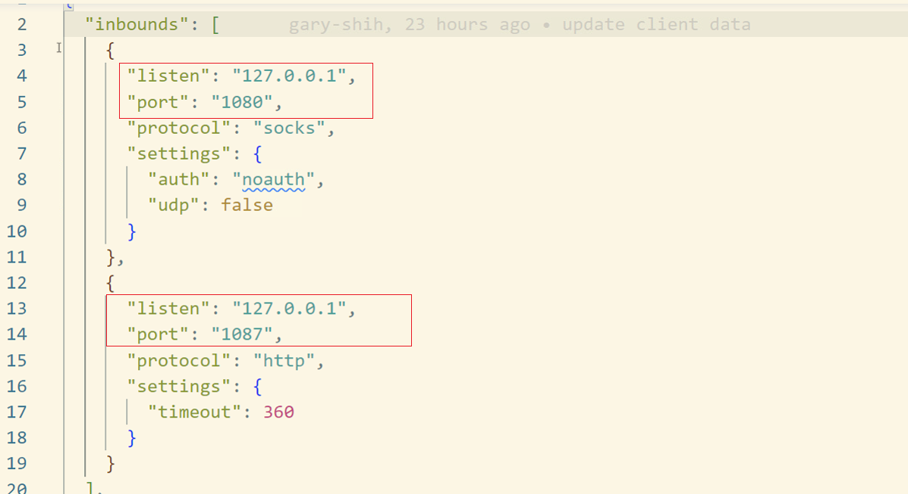
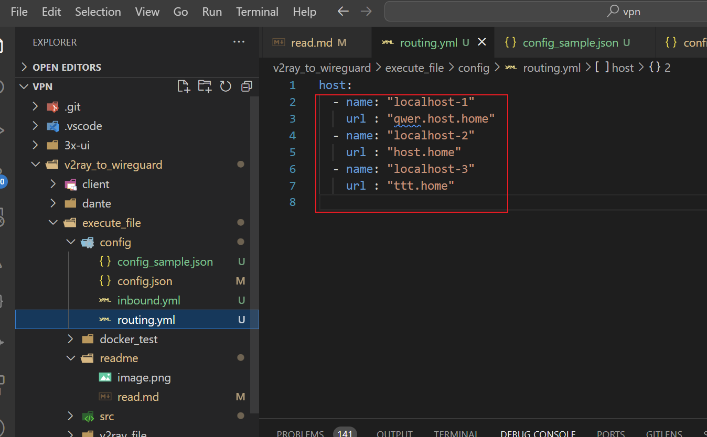

## 中止 v2ray listen port

```
(LocalAddress 與 LocalPort 依照 comfig/config.json 中 inbounds 裡的 listen 與 port)
$connection = Get-NetTCPConnection -LocalPort 1080 -LocalAddress 127.0.0.1 | Where-Object { $_.State -ne 'TimeWait' }; if ($connection -and $connection.State -ne 'Idle') { Stop-Process -Id $connection.OwningProcess } 
$connection = Get-NetTCPConnection -LocalPort 1087 -LocalAddress 127.0.0.1 | Where-Object { $_.State -ne 'TimeWait' }; if ($connection -and $connection.State -ne 'Idle') { Stop-Process -Id $connection.OwningProcess }

查看
netstat -ano | findstr :1080
netstat -ano | findstr :1087

關閉 proxy 
Set-ItemProperty -Path "HKCU:\Software\Microsoft\Windows\CurrentVersion\Internet Settings" -Name ProxyEnable -Value 0
```

## 增加 domain vpn 除外
在 config\routing.yml 自行添加，數量不限



## 增加 user id 選擇，請添加 comfig/user.yml (需要配合server端，請勿自行添加)
## comfig/config.json 中 (需要配合server端，請勿自行更動)